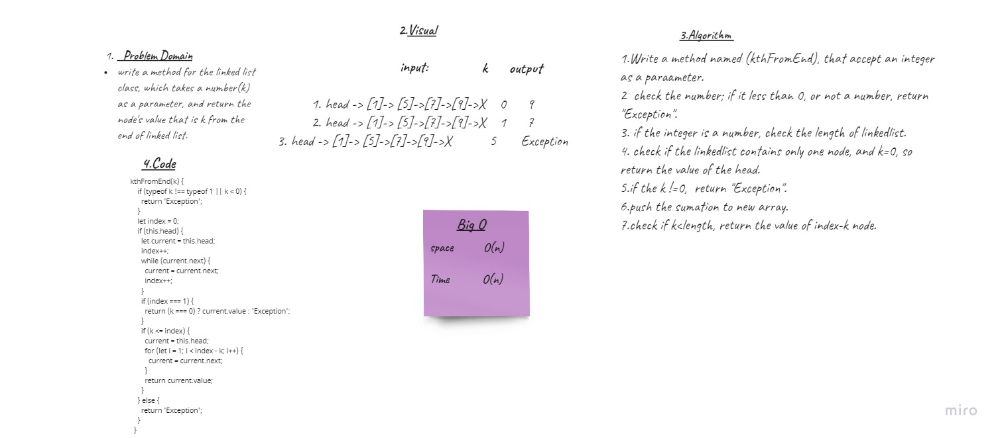

# Linked List

A linked list is a linear data structure, in which the elements are not stored at contiguous memory locations.

## Singly Linked List

Linked List can be defined as collection of objects called nodes that are randomly stored in the memory.

## Approach & Efficiency

* Each Node always has at least value property and a next property, with the default value of next being null

* When the user `insert` to the  linked list, the new node (recently inserted) will be the head of the list and it will point to the previous head of the list.

* The last node of the list is the tail of the linked list and it  points to null.

****

## API

* `insert` method: space O(1) and time O(1) : it takes any value as an argument and adds a new node with that value to the head of the list with an O(1) Time performance.

* `includes` method: space O(n) and time O(n) : it takes any value as an argument and returns a boolean result depending on whether that value exists as a Node’s value somewhere within the list.

****

* `toString` method: space O(n) and time O(n) : takes in no arguments and returns a string representing all the values in the Linked List, formatted as:
`"{ a } -> { b } -> { c } -> NULL"`

* `append` method : which adds a new node with the given value to the end of the list.

****

* `insertBefore` method: which add a new node with the given newValue immediately before the first value node.

****

* `.insertAfter` method: which add a new node with the given newValue immediately after the first value node.

* `kthFromEnd` method:  which takes a number (k) as parameter and return the node’s value that is k from the end of the linked list.
<<<<<<< HEAD

## Whiteboard (kth function)

## Testing

=======
****
## Testing

>>>>>>> ae36fc885267d3df63368197db57b2140f4d6f2a
