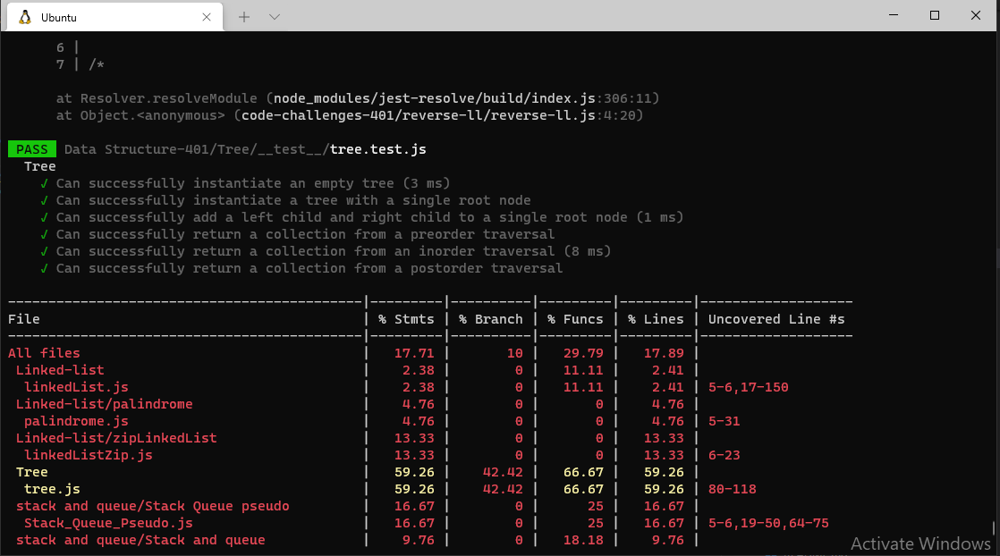

# Binary Tree & Binary Search Tree

## Challenge

In this challenge we will write the code for binary tree and binary search tree methods.

- `binary search tree`: a node-based binary tree data structure which has the following properties:

  - The left subtree of a node contains only nodes with keys lesser than the node’s key.
  - The right subtree of a node contains only nodes with keys greater than the node’s key.
  - The left and right subtree each must also be a binary search tree.

- `binary tree`: A tree whose elements have at most 2 children is called a binary tree. Since each element in a binary tree can have only 2 children, we typically name them the left and right child.
***
## Testing 

## Approach & Efficiency

- Space : O(h) where h is the height
- Time : O(log n/2)
***
## API

1. Binary Tree:

   - `preOrder(root)`: method for traversing through the tree with following order: Parent node → left node → Right Node.

   - `inOrder(root)`: method for traversing through the tree with following order: left node → Parent node → Right Node.

   - `postOrder(root)`: method for traversing through the tree with following order: left node → Right Node → Parent node.

2. ## Binary Search Tree

   - `add(value)`: method for adding a value to the tree.
   - `contains(value)`: checks wether the value exists in the tree or not.
   - `insertTree`: method for inserting into the tree, check if the value bigger than the root it will add it to the left node and vise versa.
