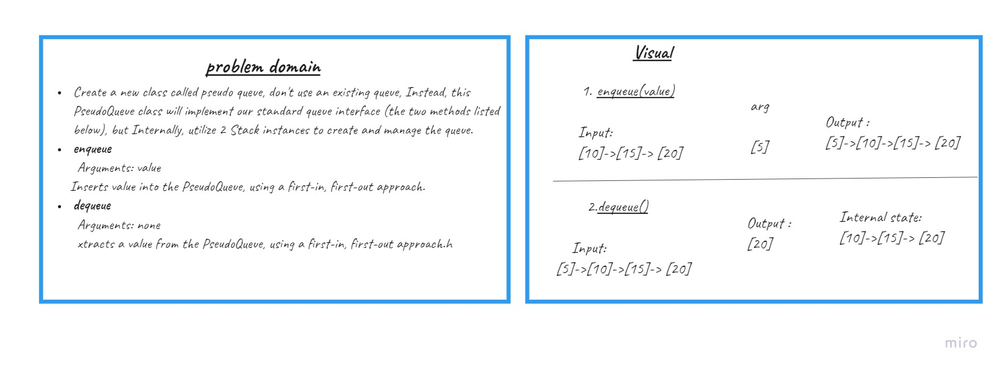
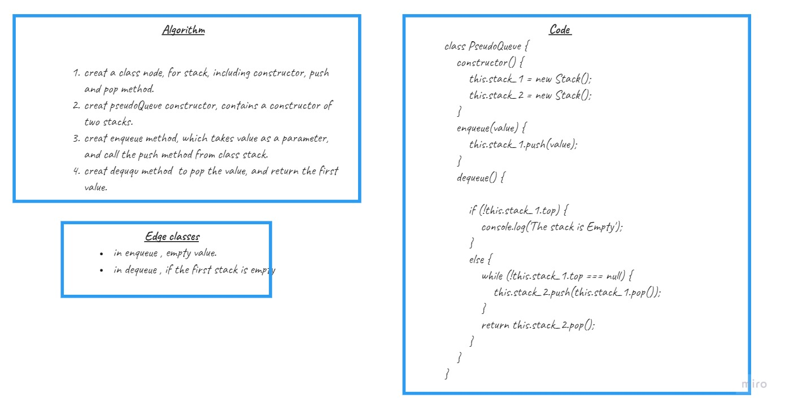
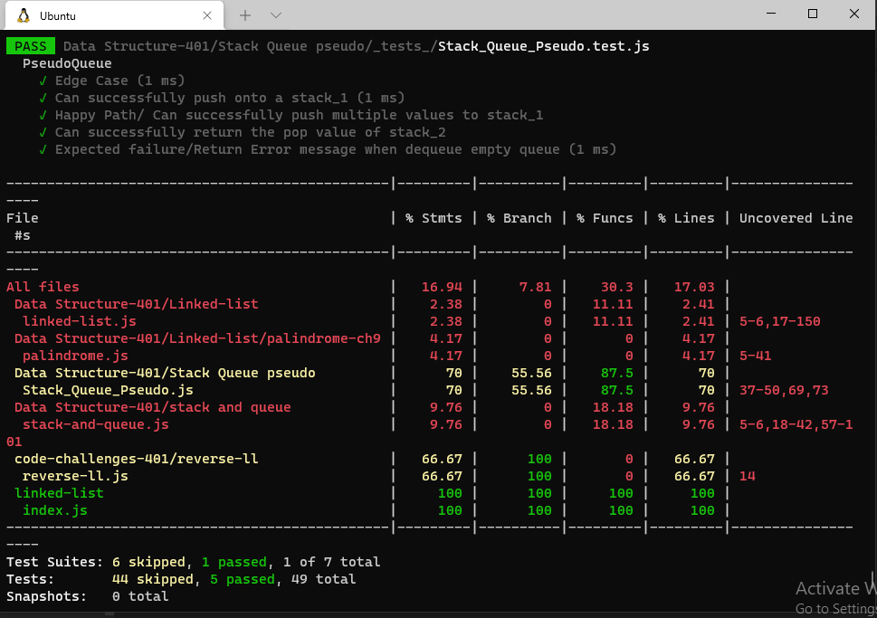

# Stack Queue Pseudo

 ## Whiteboard 

## Testing

## Approach & Efficiency

* enqueue:
  * Time: O(1)
  * Space: O(1)

* dequeue:
  * Time: O(n)
  * Space: O(n)

## API

* Stack

  * `push()`: look at the first available index and add the element there.
  * `pop()`: remove from the top of the stack.
  * `peek()`: shows which element would be removed next, but doesnot actually remove it.
  * `size()`: it will look at the size variable.
  * `isEmpty()`: return whether or not there is an elements in the the stack.

* Queue
  * `enqueue()`: add element to the queue.
  * `dequeue()`: it will remove the first element enqueued to the queue.
  * `peek()`: return the first added without removing it.
  * `empty()`: checks whether if the the queue is empty or not.

