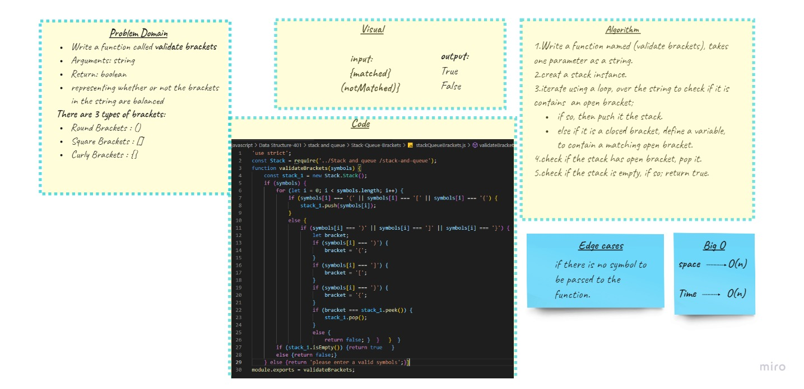
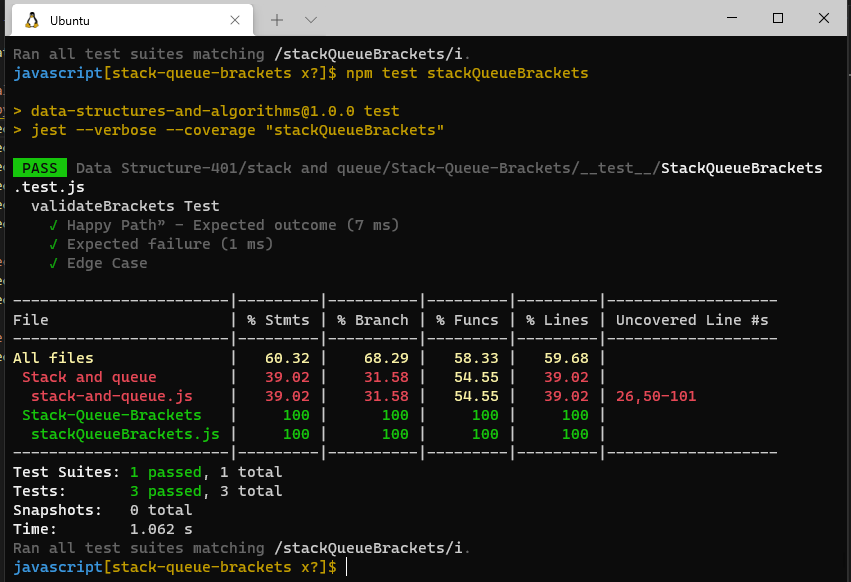

# Stack & Queues Brackets

## Challenge 

In this challenge we will write the code for validating the matching brackets pairs.
 
 ## Whiteboard 

 
## Testing

## API

* `validateBrackets(symbols)`: return whether the input string is having a balanced paranthesis or not.
