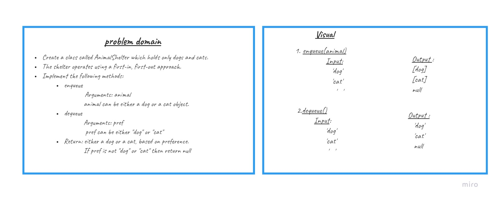
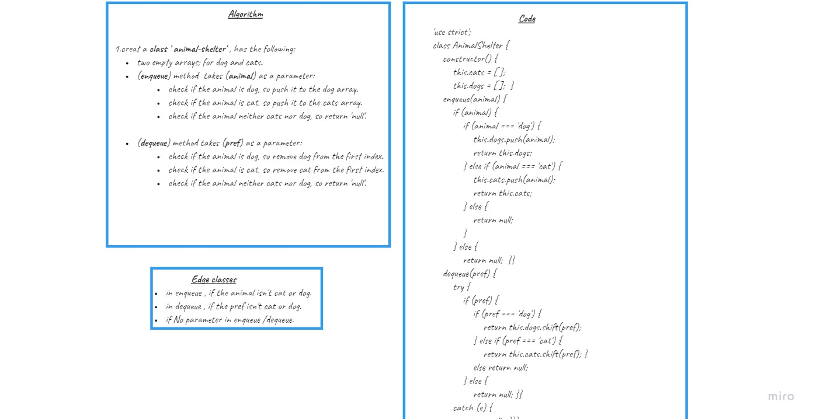
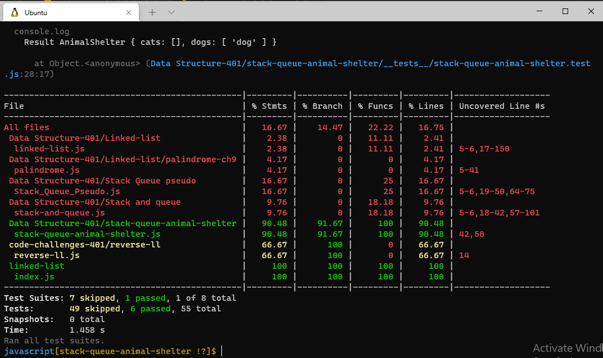

# Stack & Queue Animal Shelter
## Challenge

### Create a class called AnimalShelter which holds only dogs and cats.
The shelter operates using a first-in, first-out approach.

 ## Whiteboard 

## Testing

## Approach & Efficiency

* enqueue:
  * Time: O(1)
  * Space: O(1)

* dequeue:
  * Time: O(1)
  * Space: O(1)

## Approach & Efficiency

* create a new class named AnimalShelter.

* add the following properties to the class (cats,dogs)

* Create enqueue method that accepts an animal as input , check if it cat or dog, if  it's false return exception else if it's dog enqueue it to the dog queue else if it's cat enqueue it to the cats queue.

`enqueue`

 * Input: animal

 * Output: new animal added to the queue of the animal.

* Create dequeue method that takes the preferred animal as input, check the queue of that animal and dequeue an animal from it.

`dequeue`

 * Input: Preferred Animal.

* Output: dequeue animal from the shelter based on it's type.

