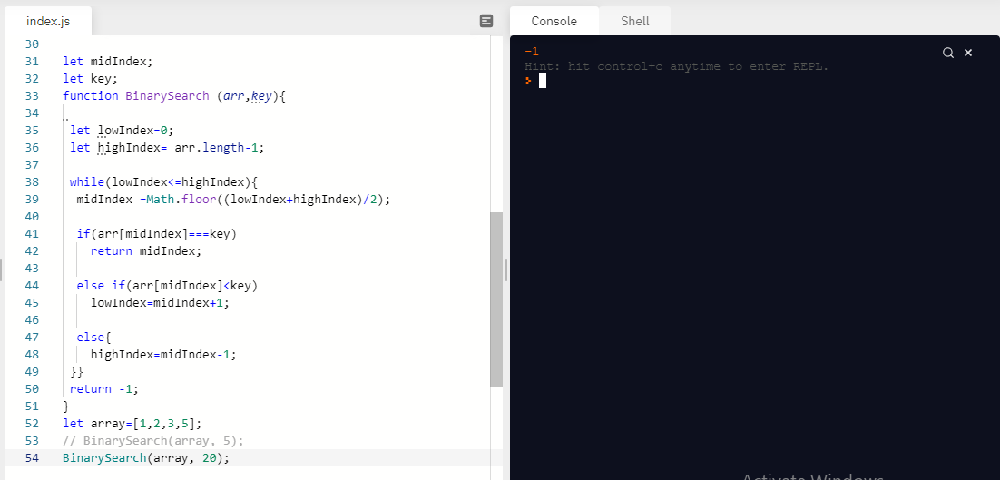

# Binary search algorithm

.jpg)

## Approach and Efficiency
creating a function, containing while loop, and search in the array, about a number if its exist.
the assignment takes 2 hours to complete.
